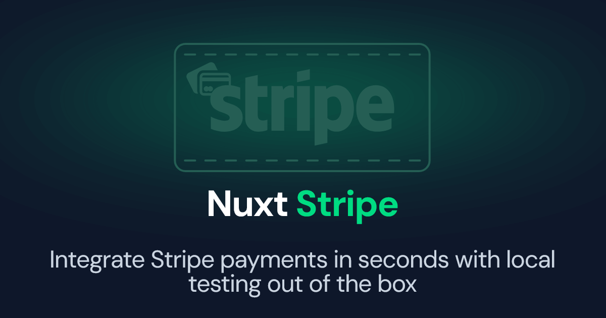

[](https://nuxt-stripe.fixers.dev)

[![npm version][npm-version-src]][npm-version-href]
[![npm downloads][npm-downloads-src]][npm-downloads-href]
[![License][license-src]][license-href]
[![Nuxt][nuxt-src]][nuxt-href]

# Nuxt Stripe

A Nuxt module for Stripe, with local webhook testing support out of the box.

- [📖 &nbsp;Read Documentation](https://nuxt-stripe.fixers.dev)
- [✨ &nbsp;Release Notes](/CHANGELOG.md)

## Features

- ⛰ &nbsp;Use Stripe with Nuxt
- ⛰ &nbsp;Support local webhook testing out of the box.
- ⛰ &nbsp;Nuxt Devtools support to explore webhook events.

### Contributing

- Clone this repository
- Enable [Corepack](https://github.com/nodejs/corepack) using `corepack enable`
- Install dependencies using `pnpm install`
- Run `pnpm dev:prepare` to generate type stubs.
- Use `pnpm dev` to start [playground](./playground) in development mode.

## 📑 License

The classy [MIT License](./LICENSE)

<!-- Badges -->
[npm-version-src]: https://img.shields.io/npm/v/@fixers/nuxt-stripe/latest.svg?style=flat&colorA=18181B&colorB=28CF8D
[npm-version-href]: https://npmjs.com/package/@fixers/nuxt-stripe

[npm-downloads-src]: https://img.shields.io/npm/dm/@fixers/nuxt-stripe.svg?style=flat&colorA=18181B&colorB=28CF8D
[npm-downloads-href]: https://npmjs.com/package/@fixers/nuxt-stripe

[license-src]: https://img.shields.io/npm/l/@fixers/nuxt-stripe.svg?style=flat&colorA=18181B&colorB=28CF8D
[license-href]: https://npmjs.com/package/@fixers/nuxt-stripe

[nuxt-src]: https://img.shields.io/badge/Nuxt-18181B?logo=nuxt.js
[nuxt-href]: https://nuxt.com

# Version 4 Update Notice

Version 4 is an upcoming major update that will introduces breaking changes.

- Webhook handler has been refactored.

The helper `defineStripeWebhook` is now `stripeWebhookHandler`, the second parameter has been removed, the callback how accept as its first parameter the `StripeEvent` and as its second parameter the context object.

```ts
// The new callback signature
type StripeWebhookHandler = (
  event: Stripe.Event,

  context: {
    $event: H3Event
    stripe: Stripe
  }
)
=> any
```
